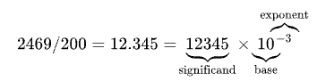
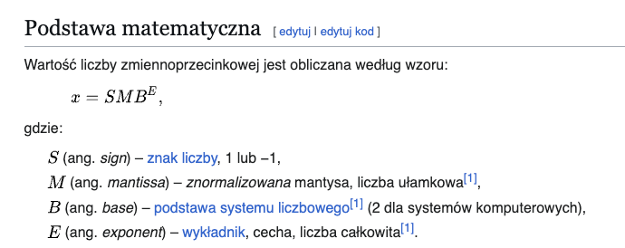
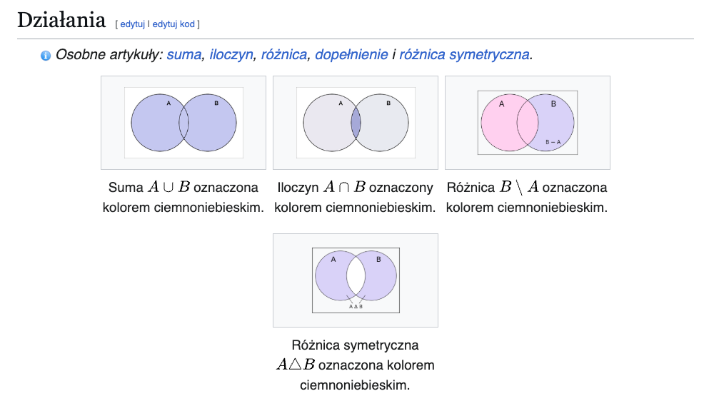
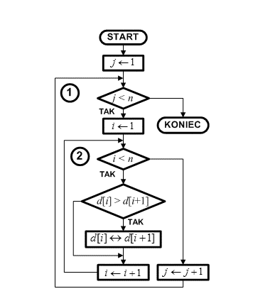
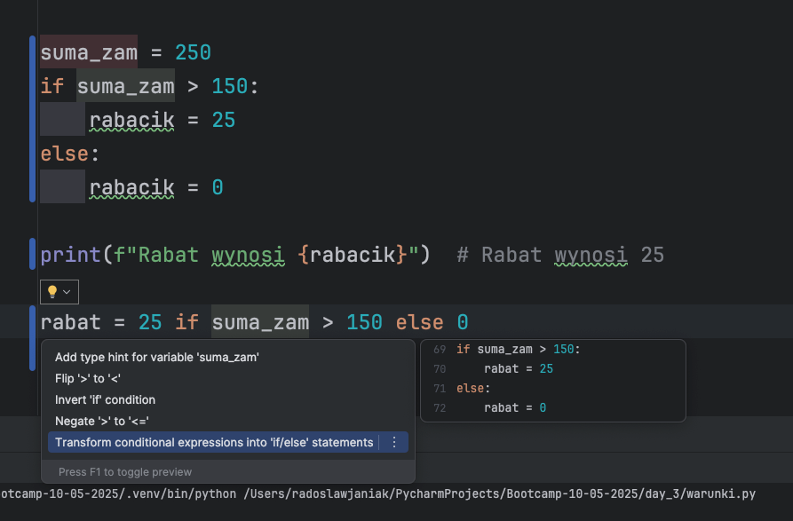
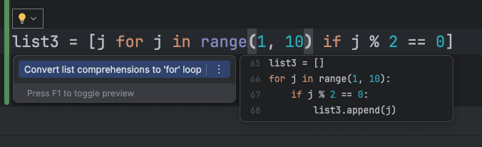

część webowa dostępna tutaj: https://github.com/rajkonkret/Bootcamp-10-05-2025-web
-----------------------
# rajkonkret660@gmail.com

https://play.google.com/store/apps/details?id=pl.rajkonkret.testjava2&hl=pl&gl=US
https://naukapythona.com.pl
-----------------------
------------------------

==    Equal to\
!=    Not equal to\
<    Less than\
\>    Greater Than\
<=    Less than or Equal to\
\>=    Greater than or Equal to\

**    Exponent    2 ** 3 = 8\
%    Modulus/Remainder    22 % 8 = 6\
//    Integer division    22 // 8 = 2\
/    Division    22 / 8 = 2.75
\*    Multiplication    3 * 3 = 9\
\-    Subtraction    5 - 2 = 3\
\+    Addition    2 + 2 = 4\

%d: formatowanie liczb całkowitych\
%f: formatowanie liczb zmiennoprzecinkowych\
%s - łańcuch znaków (string)\
%e lub %E: formatowanie liczb w notacji naukowej\
%x lub %X: formatowanie liczb w formacie szesnastkowym\
%o: formatowanie liczb w formacie ósemkowym\
%c: formatowanie pojedynczych znaków\

%r - reprezentacja obiektu (repr)\
%s - łańcuch znaków (string)\
%d - liczba całkowita (integer)\
%i - liczba całkowita (integer)\
%o - liczba w formacie ósemkowym (octal)\
%u - liczba całkowita bez znaku (unsigned decimal)\
%x - liczba w formacie szesnastkowym (hexadecimal)\
%X - liczba w formacie szesnastkowym (hexadecimal) z wielkimi literami\
%e - liczba w notacji naukowej (exponential)\
%E - liczba w notacji naukowej (exponential) z wielkimi literami\
%f - liczba zmiennoprzecinkowa (float)\
%F - liczba zmiennoprzecinkowa (float)\
%g - liczba zmiennoprzecinkowa (float) w formacie kompaktowym\
%G - liczba zmiennoprzecinkowa (float) w formacie kompaktowym z wielkimi literami\
%c - pojedynczy znak (character)\
%p - adres pamięci obiektu\
%% - znak % (percent)\
\
\n - Nowa linia\
\r - Powrót karetki\
\t - Tabulacja pozioma\
\b - Powrót kursora (usuwa poprzedni znak)\
\f - Przesunięcie strony\
\v - Tabulacja pionowa\
' - Apostrof (literał apostrofu)\
" - Cudzysłów (literał cudzysłowu)\
\a - Dźwięk systemowy lub sygnał alarmowy\
\ooo - Znak o wartości oktalnej (np. \012 reprezentuje znak nowej linii)\
\xhh - Znak o wartości szesnastkowej (np. \x0A reprezentuje znak nowej linii)\
\uXXXX - Znak Unicode o wartości czteroznakowego kodu szesnastkowego\
\UXXXXXXXX - Znak Unicode o wartości ośmioznakowego kodu szesnastkowego\
\N{name} - Znak Unicode o podanej nazwie\

\033[31m: Set text color to red\
\033[32m: Set text color to green\
\033[33m: Set text color to yellow\
\033[34m: Set text color to blue\
\033[35m: Set text color to magenta\
\033[36m: Set text color to cyan\
\033[37m: Set text color to white\
\033[0m: Reset text color to default\
\033[1m: Set text style to bold\
\033[4m: Set text style to underline\
print("\033[31mHello\033[0m") - kolorki

### The and Operator’s Truth Table:
Expression    Evaluates to\
True and True    True\
True and False    False\
False and True    False\
False and False    False

### The or Operator’s Truth Table:

Expression    Evaluates to\
True or True    True\
True or False    True\
False or True    True\
False or False    False

### The not Operator’s Truth Table:
Expression    Evaluates to\
not True    False\
not False

## Dla daty:
%Y: Rok z pełną liczbą cyfr, np. "1989", "2023".\
%y: Rok z dwiema ostatnimi cyframi, np. "89", "23".\
%m: Miesiąc z zerem wiodącym, np. "01" do "12".\
%d: Dzień miesiąca z zerem wiodącym, np. "01" do "31".\
%B: Pełna nazwa miesiąca, np. "January", "December".\
%b: Skrócona nazwa miesiąca, np. "Jan", "Dec".\
%A: Pełna nazwa dnia tygodnia, np. "Monday", "Sunday".\
%a: Skrócona nazwa dnia tygodnia, np. "Mon", "Sun".\
Dla czasu:\
%H: Godzina w formacie 24-godzinnym z zerem wiodącym, np. "00" do "23".\
%I: Godzina w formacie 12-godzinnym z zerem wiodącym, np. "01" do "12".\
%p: AM/PM.\
%M: Minuty z zerem wiodącym, np. "00" do "59".\
%S: Sekundy z zerem wiodącym, np. "00" do "59".\
%f: Mikrosekundy, np. "000000" do "999999".

spam += 1    spam = spam + 1\
spam -= 1    spam = spam - 1\
spam *= 1    spam = spam * 1\
spam /= 1    spam = spam / 1\
spam %= 1    spam = spam % 1

## Float - problem zaokrąglenia

https://www.w3schools.com/python/default.asp \
https://www.hackerrank.com/domains/python \
https://www.hackerrank.com/domains/python \
https://stackoverflow.com/questions/63214621/how-to-use-print-statement-in-python

# Zbiory

## casfold porównanie
https://www.unicode.org/Public/12.1.0/ucd/CaseFolding.txt

## Sortowanie algorytm
### Pokazuje zmiany sterowania przepływem programu

# operator warunkowy

# list comprehensions

# pip freeze
pip freeze > requirements.txt \
pip install -r requirements.txt

# api
https://github.com/public-apis/public-apis

# klient HTTP
| Biblioteka | Asynchroniczność       | Wydajność (przy wielu zapytaniach)     | Łatwość użycia | HTTP/2 |
|------------|------------------------|----------------------------------------|----------------|--------|
| requests   | Nie                    | Średnia                                | Bardzo łatwa   | Nie    |
| httpx      | Tak                    | Wysoka                                 | Łatwa          | Tak    |
| aiohttp    | Tak                    | Wysoka                                 | Średnia        | Tak    |
| urllib3    | Nie                    | Wysoka (w synchronicznym środowisku)   | Łatwa          | Tak    |
| grequests  | Nie (ale równoległe)   | Wysoka                                 | Łatwa          | Nie    |

# SOLID

SOLID to akronim pięciu zasad projektowania obiektowego, \
które pomagają tworzyć kod bardziej czytelny, elastyczny i łatwy w utrzymaniu.

S — Single Responsibility Principle (SRP) \
O — Open/Closed Principle (OCP) \
L — Liskov Substitution Principle (LSP)\
I — Interface Segregation Principle (ISP)\
D — Dependency Inversion Principle (DIP) \
Korzyści stosowania SOLID \
	•	Łatwiejsze testowanie (wstrzykiwanie mocków). \
	•	Kod bardziej odporny na zmiany. \
	•	Lepsza czytelność i separacja odpowiedzialności. \
	•	Ułatwiona rozbudowa i konserwacja. 

Stosowanie SOLID to drogowskaz, \
nie twardy przepis – warto wyważyć, \
czy w małym skrypcie opłaca się wprowadzać wszystkie abstrakcje, \
czy wystarczy prostsze rozwiązanie. 

# pliki exe
 pip install pyinstaller \
 pyinstaller --onefile --noconsole okno_1.py \
 pyinstaller --onefile --windowed okno_1.py
 
https://nuitka.net/ \
nuitka --standalone --onefile --macos-create-app-bundle --follow-imports --include-package=pygame zegar_pygame.py

# figma

https://www.youtube.com/watch?v=bD3rx1tCRGQ

# pyqt - pygui

https://www.pythonguis.com/ 
https://www.pythonguis.com/pyside6-tutorial/

# testowanie

| Cecha                    | unittest                                                                 | pytest                                                                                       |
|--------------------------|--------------------------------------------------------------------------|----------------------------------------------------------------------------------------------|
| **Pochodzenie**          | Wbudowany w Pythona (inspirowany JUnit z Javy)                        | Zewnętrzny pakiet skoncentrowany na prostocie i czytelności                                 |
| **Sposób pisania testów**| Klasy dziedziczące `unittest.TestCase` Metody zaczynają się od `test_`| Funkcje (lub metody w klasach) Wystarczy nazwać je `test_…`                                 |
| **Assercje**             | `self.assertEqual(a, b)` `self.assertTrue(x)` itd.                   | Zwykłe `assert a == b` pytest wyświetli szczegółowe wartości po obu stronach               |
| **Parametryzacja**       | Trudniejsza – wymaga `subTest()` lub pętli w kodzie testu             | Dekorator `@pytest.mark.parametrize` łatwe generowanie wielu wariantów                     |
| **Fixtures**             | `setUp()`, `tearDown()`, `setUpClass()`, `tearDownClass()`           | `@pytest.fixture` z różnymi scope i wstrzykiwaniem przez nazwę argumentu                   |
| **Odkrywanie testów**    | `python -m unittest discover`                                            | Automatyczne wyszukiwanie plików `test_*.py` i funkcji/metod `test_…`                         |
| **Raporty i opcje**      | Standardowe raporty mniej opcji CLI                                    | Bogate opcje CLI i wtyczki (HTML-report, Coverage, xdist do równoległego uruchamiania itd.)   |
| **Ekosystem**            | Niewielki                                                               | Ogromny: pytest-cov, pytest-mock, pytest-xdist, pytest-django itd.                             |
| **Krzywa uczenia**       | Wyższa – „ceremonialny” (klasy, metody)                                  | Niska – piszesz po prostu funkcje i `assert`                                                  |

# cześć webowa
https://github.com/rajkonkret/Bootcamp-10-05-2025-web

